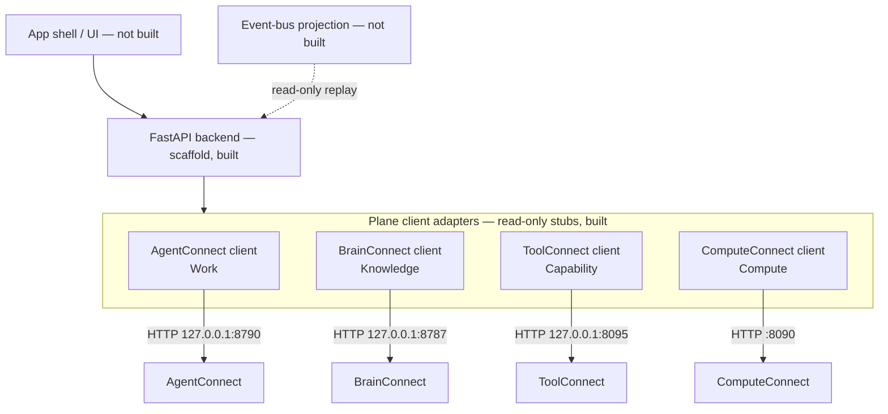

# Connect-Control architecture (initial)

> **Status: design + scaffold.** The shape below is the intended architecture.
> Only the pieces marked *(built)* exist in code; everything else is the design
> the scaffold converges on, per the ecosystem honesty convention.

## The one rule

Connect-Control is the **thin Control plane**: it coordinates the four
infrastructure planes and is never a fifth authority. Every fact it shows comes
from the owning plane's public API or the ecosystem event bus; every change it
ever makes goes through the owning plane's public API. It never opens another
plane's database, never reads another plane's files, and never re-implements a
plane's decision.

## Component sketch

Solid lines exist in the scaffold; dashed lines are designed but unbuilt.

### App shell *(not built)*

The user-facing surface (web first; desktop packaging is an open question the
roadmap does not pre-decide). Hosts the workspace-centric screens. Owns no
logic beyond presentation; all state flows through the backend.

### Backend *(scaffold, built)*

FastAPI application factory (`connect_control.app.create_app`) with:

- `GET /healthz` — own liveness.
- `GET /planes` — configured plane endpoints (configuration echo only).
- `GET /planes/{name}/health` — read-only proxy of each plane's real health
  route, reporting exactly what the plane answered (including unreachable).
- `POST|PUT|PATCH|DELETE /planes/{name}/...` — **501 Not Implemented**, by
  design, until mutation lands via an owning plane's public API.

### Plane client adapters *(read-only stubs, built)*

One thin `httpx` client per plane (`connect_control.planes`), pinned to the
ecosystem port registry in Connect's
[COMPATIBILITY.md](https://github.com/Judgernaut777/Connect/blob/main/COMPATIBILITY.md):

| Plane | Product | Default endpoint | Notes |
|---|---|---|---|
| Work | AgentConnect | `http://127.0.0.1:8790` | `agentconnect-api`; every route except `/health` is authorized |
| Knowledge | BrainConnect | `http://127.0.0.1:8787` | `brainconnect serve`; optional bearer token |
| Capability | ToolConnect | `http://127.0.0.1:8095` | loopback decision point; no invocation route exists there either |
| Compute | ComputeConnect | `http://127.0.0.1:8090` | six `LocalComputeProvider` routes + `GET /health` |

Adapters are honest by construction: a probe reports the plane's verbatim
answer or the verbatim connection error, and `mutate()` raises
`MutationNotImplemented`. There is no fake business logic to mistake for a
capability. Cross-plane contracts (`memory_adapter` 1.0,
`local_compute_provider` 1.0, `toolconnect_governor` 1.1) are owned by
`agentconnect-core`; these adapters consume the planes' HTTP surfaces, never
shared code.

### Workspace abstraction *(not built)*

The **workspace** — an isolated place where agent work happens under a name, a
policy, and a budget — is the stable, user-facing object of this application
(per PRODUCT_THESIS.md). Connect-Control will project workspaces out of the
planes' own records (AgentConnect owns workspace lifecycle) rather than
maintaining a competing workspace database. Design only; no code.

### Event-bus projection *(not built)*

The ecosystem's append-only
[event bus](https://github.com/Judgernaut777/Connect/blob/main/EVENT_BUS.md) is
a *projection, never a system of record*. Connect-Control will consume it
**read-only** for cross-plane observability (activity timelines, health
history). It will not publish control-plane events until there is a control
plane fact worth recording, and it will never treat the bus as a source of
truth — a plane that cannot reach the bus keeps working, and so does this app.

## Data stance

The control plane holds as little customer data as technically possible
(DATA_AND_COMPLIANCE_BOUNDARIES.md in the Connect repo): no prompts, outputs,
code, memory contents, secrets, tool payloads, or workspace files pass through
or persist here. Configuration (plane endpoints, display names, UI state) is
the only state this application intends to own.
