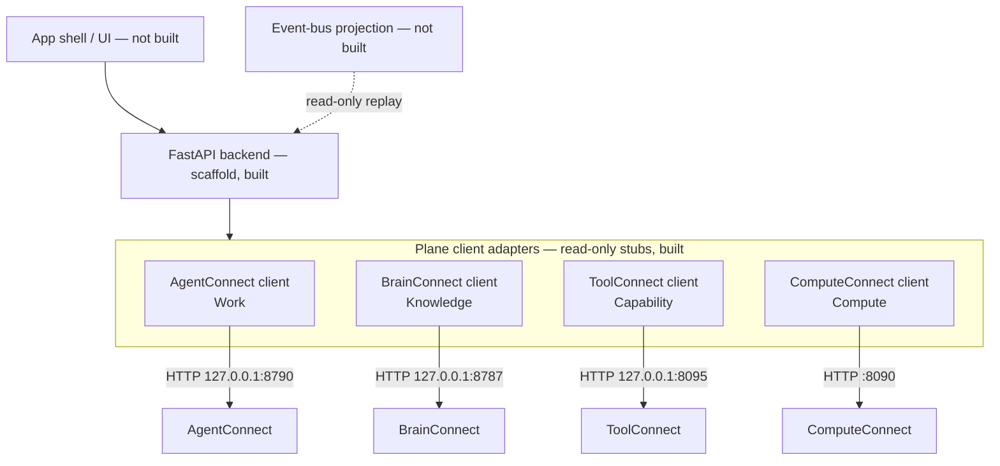

# Connect-Control architecture (initial)

> **Status: design + scaffold + the R7 surfaces.** The shape below is the
> intended architecture. Only the pieces marked *(built)* exist in code;
> everything else is the design the scaffold converges on, per the ecosystem
> honesty convention. R7 added the four UI surfaces and — with the documented,
> temporary exception below — the first controlled deviation from "the one
> rule".

## The one rule

Connect-Control is the **thin Control plane**: it coordinates the four
infrastructure planes and is never a fifth authority. Every fact it shows comes
from the owning plane's public API or the ecosystem event bus; every change it
ever makes goes through the owning plane's public API. It never opens another
plane's database, never reads another plane's files, and never re-implements a
plane's decision.

## The R7 Option-B exception

> **Amendment (R7, 2026-08): an explicit, temporary, narrow exception to
> "never direct database access", with a named expiry condition. This section
> is the record of that decision; it exists so the deviation is auditable
> rather than silent.**

**Decision.** No plane today exposes a record-read HTTP API for Decision
Records, execution grants, or Execution Records — the single-identifier
traversal Connect-Governance's `EXECUTION_RECORD.md §5` reserves for R7. The
constitution-pure alternative (Option A) would have meant inventing an entire
HTTP service inside Connect-Governance (today a library with zero HTTP
surface) plus read routes in two more repos, in one milestone. R7 therefore
ships **Option B**: a read-only *audit projection* in Connect-Control that
opens the three planes' SQLite stores directly, plus one in-process intake
path for Work Request creation.

**The exception's exact shape — anything beyond this is still forbidden:**

1. `connect_control.audit` opens the governance, AgentConnect, and ToolConnect
   SQLite files **read-only** (`sqlite3.connect("file:…?mode=ro", uri=True)`)
   and runs only indexed SELECTs over the four linkage ids
   (`work_request_id` / `decision_record_id` / `grant_id` / `correlation_id`).
   It never writes. An unconfigured or unreadable path is a *degraded
   surface*, reported as such — never a fabricated empty trail.
2. Chain verification on read **imports the owning plane's verifier**
   (`agentconnect.core.execution_records.verify_execution_record`); when the
   package is absent the chain is reported `unverified (verifier unavailable)`.
   Canonicalization is never re-implemented here. Grant signatures are not
   re-verified either: the provider verified them at redemption and recorded
   that fact; the projection checks only that the stored canonical bytes
   still parse and that key ids match.
3. The **one mutation** (S1, Work Request creation) goes through
   `connect_governance.work_requests.create_work_request` imported in-process
   against the governance DB — the governance package's own kernel-evaluated,
   fail-closed intake — **never raw SQL**. A Kernel refusal rolls the whole
   transaction back and surfaces as a 4xx with the reason.

**Why this is acceptable for the slice.** Audit must survive plane outage (a
plane that is down cannot serve its own evidence); every needed index already
exists; and wrapping a store directly matches the ecosystem's own
event-log-provider precedent.

**Expiry condition.** This exception ends when per-plane record-read APIs
land — **earmarked R8/R9** (Option A's governance read API is the named
migration). At that point `connect_control.audit`'s direct reads are replaced
by HTTP reads through the owning planes and this section is amended again.
The coupling it creates (three SQLite schemas read directly) is the deliberate
price, paid once, and paid back at the expiry.

## Component sketch

Solid lines exist in the scaffold; dashed lines are designed but unbuilt.

### App shell *(not built)*

The user-facing surface (web first; desktop packaging is an open question the
roadmap does not pre-decide). Hosts the workspace-centric screens. Owns no
logic beyond presentation; all state flows through the backend.

### Backend *(scaffold, built)*

FastAPI application factory (`connect_control.app.create_app`) with:

- `GET /healthz` — own liveness.
- `GET /planes` — configured plane endpoints (configuration echo only).
- `GET /planes/{name}/health` — read-only proxy of each plane's real health
  route, reporting exactly what the plane answered (including unreachable).
- `POST|PUT|PATCH|DELETE /planes/{name}/...` — **501 Not Implemented**, by
  design, until mutation lands via an owning plane's public API. (S1's Work
  Request creation is *not* on this path: it is a governance-plane operation
  through the documented Option-B in-process intake, not a plane proxy.)

### The four R7 surfaces *(built)*

Server-rendered (Jinja2 — a disclosed new dependency; no frontend framework,
consistent with the scaffold), all read-only except S1's creation:

- **S1 Work Request creation + status** (`/work-requests`) — the one mutation,
  through Connect-Governance's kernel-evaluated intake (see the Option-B
  exception). Fail-closed: a non-Allowed Decision rolls everything back and
  answers 422 with the Kernel's reason.
- **S2 Decision + explanation** (`/decisions/{record_id}`) — rehydrates the
  stored record via `connect_governance.decisions.load_record` and renders
  `connect_governance.explanation.explain`, a pure projection computed on
  read.
- **S3 Marketplace / provider activation (minimal)** (`/marketplace`) —
  ToolConnect's live health + catalog over HTTP through the plane-client
  idiom, plus activation derived from grants issued for
  `provider_id='toolconnect'` and the ADR-052 revocation-list meta. The full
  marketplace is R8.
- **S4 Linked audit trail** (`/audit/{identifier}`) — one identifier (any of
  the four linkage ids) resolves to the joined trail across the three stores:
  work request → decision → grant → redemption / provider-enforcement →
  execution records, rendered as a timeline with per-chain verification
  status and honest degraded-surface labels.

### Plane client adapters *(read-only stubs, built)*

One thin `httpx` client per plane (`connect_control.planes`), pinned to the
ecosystem port registry in Connect's
[COMPATIBILITY.md](https://github.com/Judgernaut777/Connect/blob/main/COMPATIBILITY.md):

| Plane | Product | Default endpoint | Notes |
|---|---|---|---|
| Work | AgentConnect | `http://127.0.0.1:8790` | `agentconnect-api`; every route except `/health` is authorized |
| Knowledge | BrainConnect | `http://127.0.0.1:8787` | `brainconnect serve`; optional bearer token |
| Capability | ToolConnect | `http://127.0.0.1:8095` | loopback decision point; no invocation route exists there either |
| Compute | ComputeConnect | `http://127.0.0.1:8090` | six `LocalComputeProvider` routes + `GET /health` |

Adapters are honest by construction: a probe reports the plane's verbatim
answer or the verbatim connection error, and `mutate()` raises
`MutationNotImplemented`. There is no fake business logic to mistake for a
capability. Cross-plane contracts (`memory_adapter` 1.0,
`local_compute_provider` 1.0, `toolconnect_governor` 1.1) are owned by
`agentconnect-core`; these adapters consume the planes' HTTP surfaces, never
shared code.

### Workspace abstraction *(not built)*

The **workspace** — an isolated place where agent work happens under a name, a
policy, and a budget — is the stable, user-facing object of this application
(per PRODUCT_THESIS.md). Connect-Control will project workspaces out of the
planes' own records (AgentConnect owns workspace lifecycle) rather than
maintaining a competing workspace database. Design only; no code.

### Event-bus projection *(not built)*

The ecosystem's append-only
[event bus](https://github.com/Judgernaut777/Connect/blob/main/EVENT_BUS.md) is
a *projection, never a system of record*. Connect-Control will consume it
**read-only** for cross-plane observability (activity timelines, health
history). It will not publish control-plane events until there is a control
plane fact worth recording, and it will never treat the bus as a source of
truth — a plane that cannot reach the bus keeps working, and so does this app.

## Data stance

The control plane holds as little customer data as technically possible
(DATA_AND_COMPLIANCE_BOUNDARIES.md in the Connect repo): no prompts, outputs,
code, memory contents, secrets, tool payloads, or workspace files pass through
or persist here. Configuration (plane endpoints, display names, UI state) is
the only state this application intends to own.
